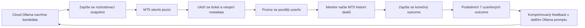

# Analýza nápadu I: zpětná vazba posledních rozhodnutí chaotic strategie

Datum analýzy: 5. 8. 2026

## Závěr

Ano, jde to realizovat a pro chaotic strategii to může být užitečné. Nemá to však fungovat jako automatické "učení" modelu ani jako mechanismus, který po několika ztrátách libovolně změní pravidla. Správná podoba je **krátkodobá, auditovatelná zpětná vazba**: před novým rozhodnutím dostane Cloud Ollama strukturovaný přehled posledních sedmi **uzavřených** obchodů chaotic strategie a má jej použít pouze jako jeden ze vstupů pro výběr dalšího kandidáta.

V současném systému jsou k dispozici dvě části potřebných dat, ale nejsou spojené do jednoho životního cyklu obchodu:

- [final_decision.py](../../bots/analysis/ollama/final_decision.py) zapisuje pro chaotic strategii do `trade_decision_audit.csv` kandidáta, směr, fázi a důvod. Do `ai_log.jsonl` ukládá, že Ollama navrhla konkrétní symbol a směr.
- [trade_execution.py](../../bots/analysis/ollama/trade_execution.py) při otevření zapisuje do `trades.csv` strategii, magic, symbol, směr, lot, cenu a výsledek odeslání pokynu.
- MT5 obsahuje skutečný výsledek až po uzavření pozice v historii dealů/objednávek.

Chybí jednoznačné spojení mezi vstupním rozhodnutím, potvrzeným MT5 ticketem a konečným výsledkem. Bez něj by se do AI dostávaly neúplné nebo chybně přiřazené informace. Nejdříve je proto nutné vytvořit vlastní auditní záznam obchodu.

## Co přesně má mechanismus hodnotit

Nejde o posledních sedm cyklů bota. Většina cyklů skončí bez obchodu nebo zablokováním strategií, což není výsledek obchodní hypotézy. Počítat se má posledních sedm **uzavřených pozic otevřených chaotic strategií**.

Jeden záznam musí odpovědět na čtyři otázky:

1. Jaké rozhodnutí padlo: symbol, `BUY`/`SELL`, čas, velikost, vstupní cena a kandidátní zdroj.
2. Proč rozhodnutí padlo: textové odůvodnění Ollamy, dostupné predikce a malý snapshot tržního/účtového kontextu.
3. Jak obchod dopadl: čas a cena uzavření, hrubý a čistý P/L, swap, komise, délka držení a důvod exitu.
4. Co z něj lze opatrně vyvodit: například série ztrát ve stejném směru, symbolu nebo market regime. Tento závěr musí být vysvětlitelný z uložených dat.

Otevřený obchod nemá být označen jako výhra ani prohra podle aktuálního floating P/L. Může se do kontextu zařadit zvlášť jako otevřená expozice, ale nesmí se míchat s uzavřenými výsledky.

## Doporučený tok dat



### 1. Záznam rozhodnutí před exekucí

V `_resolve_chaotic_ollama_candidate()` je po získání odpovědi Ollamy potřeba uložit celý ověřený JSON payload, ne pouze `recommended_symbol` a `action`. Důležité je také uložit `decision_id` typu UUID. Stejné `decision_id` se pak předá do `_attempt_chaotic_trade()` a do `execute_trade()`.

Záznam `trade_logs/chaotic_decision_journal.jsonl` může vypadat takto:

```json
{
  "event": "decision_created",
  "decision_id": "4e6ea4f0-0a4d-4fd6-baa3-3d572c7677a1",
  "timestamp_utc": "2026-08-05T10:00:03+00:00",
  "strategy_id": "chaotic",
  "symbol": "EURUSD_ecn",
  "action": "BUY",
  "candidate_source": "chaotic_ollama",
  "ollama_reasoning": "Predikce preferuje BUY, otevrene pozice nejsou na EURUSD.",
  "prediction_snapshot": {
    "buy": 44.0,
    "sell": 28.0
  },
  "account_snapshot": {
    "balance": 1000.0,
    "equity": 986.4,
    "free_margin_percent": 14.2
  },
  "feedback_version": 1
}
```

Snapshot nemá obsahovat celý velký seznam všech svíček ani všechny AI odpovědi. Stačí hodnoty, které skutečně vedly k výběru: predikce daného symbolu, počet otevřených pozic, maržové pásmo, ATR použitý pro TP a verze promptu. Díky tomu bude záznam malý, stabilní a auditovatelný.

### 2. Potvrzení otevřené pozice z MT5

Současné `execute_trade()` vrací jen `bool`. To není pro spárování dostačující. MT5 odpověď ale při úspěchu obsahuje identifikátory dealu/orderu; z nich lze dohledat position ID. Doporučená změna je zavést návratový objekt, například `TradeExecutionResult`, místo pouhého `True`/`False`:

```python
@dataclass(frozen=True)
class TradeExecutionResult:
    success: bool
    deal_ticket: int | None = None
    order_ticket: int | None = None
    position_ticket: int | None = None
    filled_price: float | None = None
    error_message: str = ""
```

Pokud změna návratové hodnoty zasahuje příliš mnoho call sites, lze nejdřív zachovat `execute_trade()` a přidat specializovanou funkci pro chaotic strategii. Dlouhodobě je ale objektový výsledek správnější: `bool` ztrácí klíčová data, která už broker v odpovědi poskytl.

Po úspěšném otevření se k původnímu `decision_id` dopíše event `position_opened` s ticketem, skutečně vyplněnou cenou a objemem. Pokud broker pokyn odmítne, zapisuje se `execution_failed`; takový záznam není obchodní outcome a nepatří do posledních sedmi výsledků.

### 3. Zápis výsledku až po uzavření

Pozice může skončit na TP, manuálním uzavření, budoucím hybridním exit mechanismu nebo jinou správou pozic. Výsledek proto nemá vytvářet vstupní rozhodovací kód, ale nezávislý monitor po zjištění, že dříve otevřený chaotic ticket už není mezi otevřenými pozicemi.

Vhodné místo je [account_monitor.py](../../bots/analysis/ollama/account_monitor.py), protože už pravidelně běží pro správu pozic. Nový modul, například `chaotic_trade_feedback.py`, má:

1. načíst neuzavřené `position_opened` záznamy chaotic strategie;
2. porovnat je s aktuálními otevřenými pozicemi;
3. pro zmizelý ticket načíst MT5 historii dealů v časovém okně od otevření;
4. sečíst uzavírací dealy dané pozice: realizovaný `profit`, `swap` a `commission`;
5. zapsat jediný neměnný event `position_closed`.

Příklad outcome záznamu:

```json
{
  "event": "position_closed",
  "decision_id": "4e6ea4f0-0a4d-4fd6-baa3-3d572c7677a1",
  "position_ticket": 28157235,
  "closed_at_utc": "2026-08-05T15:42:31+00:00",
  "close_price": 1.08412,
  "gross_profit": 3.18,
  "swap": -0.03,
  "commission": -0.10,
  "net_profit": 3.05,
  "outcome": "win",
  "holding_minutes": 342,
  "close_reason": "take_profit",
  "close_reason_source": "mt5_history"
}
```

Pravidlo výsledku je jednoduché: `win`, pokud `net_profit > 0`; `loss`, pokud `net_profit < 0`; `flat`, pokud je nula po zaokrouhlení na měnu účtu. Čistý výsledek má být vypočten jako

$$
net\_profit = profit + swap + commission
$$

MT5 komise běžně bývá záporná, proto se má přičítat se svým znaménkem, ne znovu odečítat.

Při částečném uzavření nesmí monitor obchod označit za konečný. Průběžně může aktualizovat agregované realized P/L, ale `position_closed` vytvoří až po úplném zmizení ticketu z otevřených pozic.

## Jak má vypadat feedback pro další rozhodnutí

Do promptu neposílat surový JSONL soubor. Nechat Python vytvořit omezený a předvídatelný souhrn. Funkce například `build_chaotic_recent_feedback(service_folder, limit=7)` má načíst posledních sedm eventů `position_closed`, spojit je s původními `decision_created` podle `decision_id` a vrátit malý JSON objekt.

```json
{
  "window": {
    "closed_trades": 7,
    "wins": 2,
    "losses": 5,
    "net_profit_total": -12.45,
    "win_rate_percent": 28.6,
    "max_consecutive_losses": 3
  },
  "recent_trades": [
    {
      "closed_at_utc": "2026-08-05T15:42:31+00:00",
      "symbol": "EURUSD_ecn",
      "action": "BUY",
      "prediction": {"buy": 44.0, "sell": 28.0},
      "net_profit": 3.05,
      "outcome": "win",
      "holding_minutes": 342,
      "close_reason": "take_profit",
      "decision_reasoning": "Predikce preferuje BUY..."
    }
  ],
  "guardrails": {
    "feedback_is_advisory": true,
    "do_not_infer_causality_from_small_sample": true
  }
}
```

Při méně než sedmi uzavřených obchodech se pošle dostupný počet včetně `closed_trades`. Nesmí se doplňovat otevřenými pozicemi ani výsledky jiných strategií. Pokud neexistuje žádný uzavřený obchod, odešle se `closed_trades: 0` a strategie funguje dosavadním způsobem.

Kromě kompletního pořadí posledních sedmi obchodů lze přidat jen bezpečné agregace:

- počet výher, ztrát a `flat` výsledků;
- čistý součet P/L a win rate;
- nejdelší série ztrát;
- počty výsledků pro stejný symbol a směr, ale pouze pokud jsou alespoň tři pozorování;
- počet obchodů uzavřených TP versus jiným mechanismem.

Nedoporučuji z tak malého vzorku počítat složité skóre, automaticky měnit velikost lotu nebo zakazovat celý symbol. Sedm obchodů je vhodný kontext pro opatrnost, nikoli statisticky průkazný model.

## Změna Ollama promptu

Funkce `ask_ollama_final_decision()` v [ollama_advisory.py](../../bots/analysis/ollama/ollama_advisory.py) může získat nový nepovinný parametr `recent_chaotic_feedback`. Použije se jen při `chaotic_mode=True`.

Do promptu se vloží oddíl ve smyslu:

```text
ZPETNA VAZBA POSLEDNICH UZAVRENYCH CHAOTIC OBCHODU:
<strukturovany JSON souhrn>

PRAVIDLA PRO ZPETNOU VAZBU:
- Jde pouze o maly vzorek, ne o dukaz zmeny trhu.
- Neotevirej obchod jen proto, abys dohnal predchozi ztratu.
- Pokud se opakuji ztraty ve stejnem symbolu a smeru, pozaduj pro stejny smer vyrazne cistejsi predikcni prevahu; nevymyslej nova pravidla mimo dodana data.
- Pokud data nejsou dostatecna nebo jsou smesena, pracuj s nimi neutralne.
- Stale vyber pouze kandidata z aktualne dodanych predikci.
```

Prompt nemá modelu přikazovat "po třech ztrátách neobchoduj". To by byl pevný, netestovaný obchodní filtr maskovaný jako AI úsudek. Má mu umožnit rozpoznat opakující se slabinu a v odpovědi vysvětlit, zda ji považuje za relevantní pro aktuální kandidát.

Odpovědní JSON je vhodné rozšířit o dvě auditní pole:

```json
{
  "recommended_symbol": "EURUSD_ecn",
  "action": "BUY",
  "reasoning": "Aktualni BUY predikce je dostatecne odlisna od poslednich neuspesnych SELL vstupu.",
  "feedback_assessment": "Posledni tri ztraty byly SELL na jinych symbolech; pro aktualni BUY nejsou primo relevantni.",
  "feedback_influenced_decision": false,
  "candidates": []
}
```

Tato dvě pole nejsou nutná pro exekuci. Jsou nutná pro pozdější kontrolu, zda model feedback skutečně používá rozumně, nebo jej jen opakuje v textu.

## Ochrany proti špatnému chování

### Feedback nesmí být jediný filtr

Aktuální predikce, maržové pásmo, limit otevřených chaotic pozic, validace symbolu a výpočet TP/marže v [final_decision.py](../../bots/analysis/ollama/final_decision.py) zůstávají autoritativní. Zpětná vazba ovlivňuje pouze poradenský výběr kandidáta v Ollamě.

### Žádné navyšování rizika po ztrátě

Lot je nyní pro chaotic strategii odvozen z `CHAOTIC_POSITION_MARGIN_PERCENT`. Feedback nemá měnit `lot_size`, maržový rozpočet, maximální počet pozic ani TP ATR násobek. Martingale nebo "dohánění" ztráty by u strategie bez veřejného SL podstatně zvýšily riziko.

### Ochrana před neúplnými a podvrženými daty

- výsledek se přebírá z MT5 historie, ne z textu AI ani z odhadu v CSV;
- do feedbacku vstupují jen záznamy se známým `position_ticket`, `closed_at_utc` a konečným `net_profit`;
- duplicitní nebo později opravený outcome se identifikuje `decision_id` a `position_ticket`;
- poškozený řádek JSONL se přeskočí a zapíše se diagnostika, nikdy se nenahradí výmyslem;
- délku `reasoning` je vhodné omezit při zápisu i při vkládání do promptu, například na 240 znaků.

### Kontextové a nákladové limity

Sedm strukturovaných výsledků je záměrný limit. Souhrn má být omezen například na 8 KB. Když limit hrozí překročením, ponechat povinná číselná pole a zkrátit volný text `decision_reasoning`; nikdy nevypouštět P/L nebo směr obchodu.

Pro odlišení budoucích úprav promptu zapisovat `feedback_version` a model použitý pro rozhodnutí. Jinak nepůjde poznat, zda změnu výsledků způsobila strategie, nový prompt nebo jiná verze modelu.

## Konfigurace

```env
# Zapne vytváření a předávání feedbacku pouze pro chaotic strategii.
CHAOTIC_FEEDBACK_ENABLED=true
# Nejvyšší počet posledních uzavřených chaotic obchodů ve feedbacku.
CHAOTIC_FEEDBACK_MAX_CLOSED_TRADES=7
# Maximální velikost serializovaného feedbacku vloženého do promptu.
CHAOTIC_FEEDBACK_MAX_CHARS=8000
# Při false se journal a outcome zapisují, ale Ollama feedback neobdrží.
CHAOTIC_FEEDBACK_INCLUDE_IN_PROMPT=true
# Počet stejných symbol+směr výsledků nutný pro uvedení agregace.
CHAOTIC_FEEDBACK_MIN_GROUP_SAMPLES=3
```

Bezpečný rollout:

1. Nejdříve přidat journal, spárování ticketu a outcome monitor s `CHAOTIC_FEEDBACK_INCLUDE_IN_PROMPT=false`.
2. Ověřit ručně alespoň několik uzavřených obchodů proti MT5 historii, zejména komise, swap, částečné close a ruční close.
3. Zapnout předávání feedbacku do promptu, ale nejprve pouze logovat `feedback_assessment` a porovnávat návrh s dosavadním výběrem.
4. Teprve po auditu zapnout běžnou exekuci s feedbackem. Rizikové parametry se v této etapě nemění.

## Testy

Před zapnutím musí existovat minimálně tyto cílené testy:

1. Úspěšná exekuce chaotic obchodu vytvoří `decision_created` a k němu `position_opened` se stejným `decision_id`.
2. Neúspěšná exekuce nevytvoří uzavřený outcome ani se neobjeví v posledních sedmi výsledcích.
3. Úplně uzavřený ticket se jednou promítne do `position_closed` a správně sečte profit, swap a komisi.
4. Částečné uzavření nevytvoří finální outcome, dokud pozice zůstává otevřená.
5. Feedback je řazen podle `closed_at_utc` sestupně, obsahuje nejvýše sedm položek a nezahrnuje jiné strategie.
6. Při nula až šesti outcomes je prompt validní a uvádí skutečný počet dat.
7. Poškozený nebo neúplný journal event nezpůsobí pád rozhodovací smyčky a nevytvoří falešný P/L.
8. `CHAOTIC_FEEDBACK_INCLUDE_IN_PROMPT=false` nepředá feedback do HTTP požadavku na Ollamu.
9. Feedback nemění lot, TP, margin budget ani maximální počet pozic.
10. Odpověď Ollamy bez nových auditních polí zůstává kompatibilní a může být exekuována podle stávajících povinných polí `recommended_symbol` a `action`.

## Doporučené pořadí implementace

1. Přidat modul `chaotic_trade_feedback.py` pro zápis, načtení a serializaci journalu.
2. Rozšířit exekuci tak, aby bezpečně vrátila ticket/price a chaotic call site zapsal `position_opened`.
3. Napojit outcome reconciliation do monitoru pozic přes MT5 historii.
4. Přidat testy spárování a výpočtu výsledků.
5. Doplnit `recent_chaotic_feedback` do `ask_ollama_final_decision()` a auditní pole odpovědi.
6. Nechat mechanismus nejdříve běžet ve sběrném režimu bez předávání do promptu, poté zapnout advisory feedback.

Tím mechanismus získá paměť posledních výsledků, ale zůstane kontrolovatelný: každé tvrzení v promptu bude dohledatelné od původního doporučení přes MT5 ticket až po skutečný realizovaný P/L.